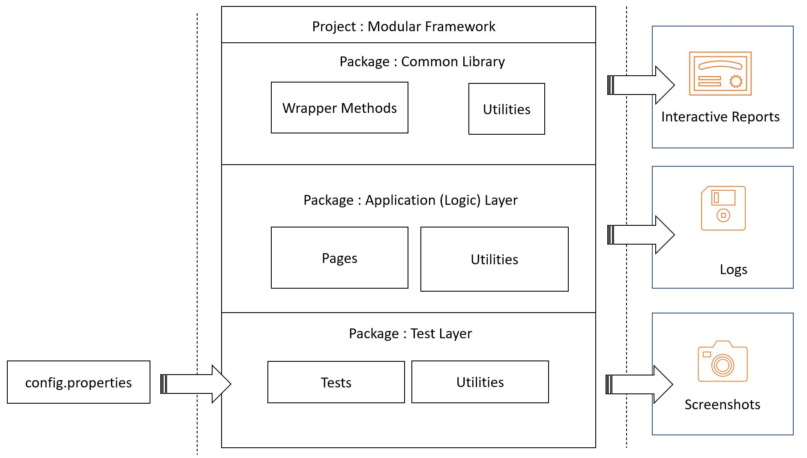

=== Course ===
- [Building Test Automation Framework using Selenium and TestNG](https://www.coursera.org/projects/building-test-automation-framework-using-selenium-and-testng) from Coursera Project Network (instructor: Saurabh Dhingra)

=== Tasks ===
- Task 1: Understanding Test Automation Framework and creating a directory structure
- Task 2: Creating an automation layer and writing a generic method to invoke a browser and navigate to a URL
- Task 3: Writing wrapper methods to perform user actions
- Task 4: Creating an application layer - using POM or Page Factory as a design pattern
- Task 5: Adding logic to the application layer
- Task 6: Writing test cases in the test layer
- Task 7: Executing test cases via TestNG XML file
- Task 8: Reading configuration from config.properties
- Task 9: Generating logs and reports using Extent report
- Task 10: Adding screenshots to failed test cases
- Task 11: Adding screenshots to the reports



=== Notes ===
- Folder Structure:
  - `src/main/java`
    - Automation layer (common actions for browsers and elements, reusable with other apps):
      - `commonLibs.implementation`
        - `CommonDriver.java`
        - `ElementControl.java`
      - `commonLibs.utils`
        - `ConfigUtils.java`
    - Application layer (elements and behavior specific to this app/page - 1 class per page):
      - `com.guru99.pages`
        - `BasePage.java`
        - `LoginPage.java` (extend BasePage)
  - `src/test/java`
    - Test layer (tests related to this page - 1 class per page):
      - `com.guru99.tests`
        - `BaseTests.java`
        - `LoginTests.java` (extend BaseTests)
  - `config`
    - Inputs:
      - `config.properties`
  - `textXmlFiles`
    - TestNG:
      - `LoginTest.xml`

- Page Object Model:
  - Create 1 class for each page.  Define all elements and logic for this page.
  - WebElements: Use `@FindBy` to locate elements, and `PageFactory.initElements(driver, this)` to initialize

- Read from config file
  - Create config file:
    - `browserType=chrome`
  - Read config file into Properties:
    ```
    FileInputStream inputStream = new FileInputStream(filename);
    Properties prop = new Properties();
    prop.load(inputStream);
    ```
  - Get the value:
    - `prop.getProperty("browserType");`

- Extent Reports:
  - Initialize report:
    ```
    ExtentSparkReporter htmlReporter = new ExtentSparkReporter(/path/to/myReport.html);
    ExtentReports extentReports = new ExtentReports();
    extentReports.attachReporter(htmlReporter);
    ```
  - Create test:
    - `ExtentTest extentTest = extentReports.createTest("My Test Case Name");`
  - Attach logs:
    ```
      @AfterMethod
      public void postTestAction(ITestResult result) {
        if (result.getStatus() == ITestResult.FAILURE) {
          extentTest.log(Status.FAIL, result.getThrowable().toString());
        }
      }
    ```
  - Attach screenshots:
    ```
    TakesScreenshot camera = (TakesScreenshot) driver;
    File imgFile = new File(/path/to/file.jpeg);
    File tmpFile = camera.getScreenshotAs(OutputType.FILE);
    tmpFile.renameTo(imgFile);
    extentTest.addScreenCaptureFromPath(imgFile);
    ```
  - Close report, write to HTML file:
    - `extentReports.flush();`

