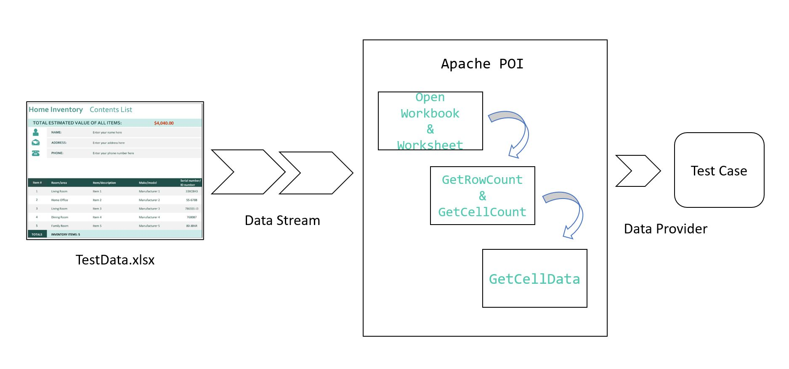

=== Course ===
- [Data-Driven Testing (via spreadsheet) with Selenium & TestNG](https://www.coursera.org/projects/data-driven-testing-via-spreadsheet-with-selenium-testng) from Coursera Project Network (instructor: Saurabh Dhingra)

=== Tasks ===
- Task 1: Understanding Data-Driven testing approach and project walk-through
- Task 2: Data-Driven testing via @DataProvider annotation 
- Task 3: Writing utility to work with Excel sheet
- Task 4: Writing utility to read test data from Excel sheet
- Task 5: Writing utility to pass test data from Excel sheet



=== Notes ===
- Apache POI - External library to work with Microsoft Office files, like Excel
- @DataProvider's method returns Object[][]
  - ```
    @DataProvider
    public Object[][] getDataFromExcel() throws Exception {
    ```
  - (1) Object - Test data can be of any type
  - (2) 2-dimensional - Stores multiple sets of data
  - ```
    Object[][] data = new Object[3][2];  // 3 sets of test data, with 2 parameters each
    data[0][0] = "mngr546003";           // Username
    data[0][1] = "bEhYrAs";              // Password
    ```
- @Test uses the data from @DataProvider for its parameters
  ```
  @Test (dataProvider = "getDataFromExcel", dataProviderClass = TestDataProvider.class)  
  public void verifyLogin(String sUsername, String sPassword) throws Exception {
  ```
- Open workbook:
  ```
  File file = new File(excelFilename);
  Workbook excelWorkbook = WorkbookFactory.create(file, null, true);
  ```
- Get row and cell:
  ```
  Sheet sheet = excelWorkbook.getSheet(sheetname);
  int rowCount = sheet.getLastRowNum();       // 0-index-based
  Row row = sheet.getRow(rowCount);           // Example for last row (change as needed)
  int cellCount = row.getLastCellNum() - 1;   // Make 0-index-based
  Cell cell = row.getCell(cellCount);         // Example for last cell in row (change as needed)
  ```
- Get cell data:
  ```
  if (cell.getCellType() == CellType.NUMERIC) {
    return String.valueOf(cell.getNumericCellValue());
  } else {
    return cell.getStringCellValue();
  }
  ```
- Read all cells, and populate contents to Object[][] for @DataProvider
  ```
  Object[][] data = new Object[rowCount + 1][cellCount + 1];
  for (int r = 0; r <= rowCount; r++) {
    for (int c = 0; c <= cellCount; c++) {
      data[r][c] = excelDriver.getCellData(sheetname, r, c);
    }
  }
  ```
- Close workbook:
  ```
  excelWorkbook.close();
  ```