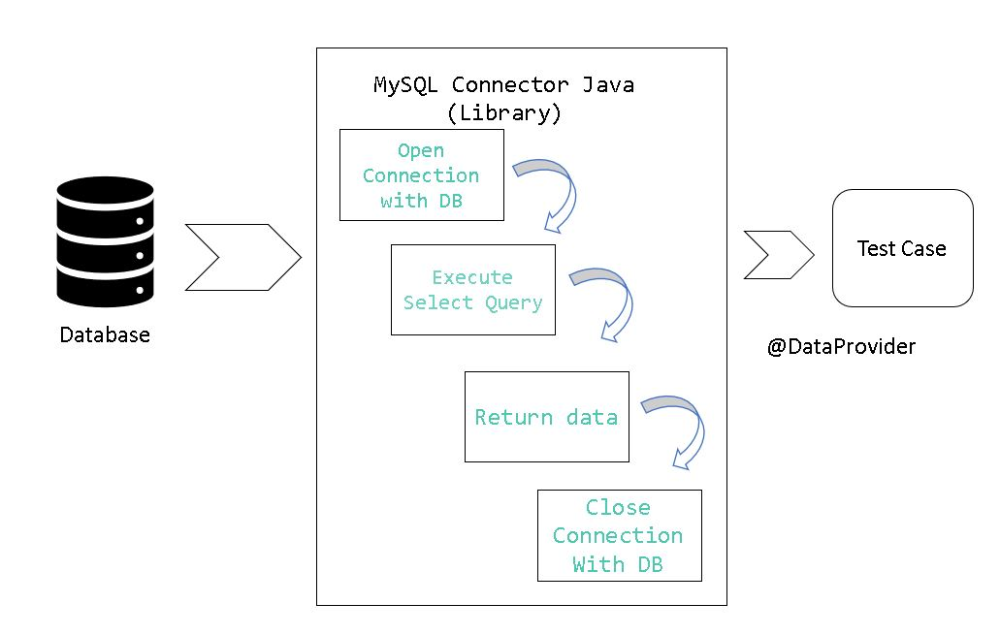

=== Course ===
- [Data-Driven Testing (via Database) with Selenium & TestNG](https://www.coursera.org/projects/data-driven-testing-via-database-with-selenium-testng) from Coursera Project Network (instructor: Saurabh Dhingra)

=== Tasks ===
- Task 1: Understanding Data-Driven testing approach and project walk-through
- Task 2: Data-Driven testing using @DataProvider
- Task 3: Setup the database with test data
- Task 4: Writing utility to establish a connection with the database
- Task 5: Writing utility to execute a select query to the database
- Task 6: Writing utility to pass test data from the database



=== Notes ===
- Data Driven Testing
  - Test a feature with multiple sets of test data
  - Test data is an external source like Excel or Database
- Download MySQL Installer - Community.  Do a custom install with:
  - MySQL Server
  - MySQL Workbench
- Tools
  - Database = MySQL
    - Execute selected SQL statements by clicking lightning bolt icon
  - Library to connect to database = JDBC (MySQL Connector/J)
- @DataProvider
  - Pass multiple sets of test data to test case
  - Returns Object[][], so data can be of any type
  - `@DataProvider` = On the utility
  - `@Test (dataProvider = "getData", dataProviderClass = TestDataSource.class)` = On the test
- Open/close/query database:
  ```
  String connectionString = String.format("jdbc:mysql://%s:%d/%s", server, portNumber, database);
  Connection connection = DriverManager.getConnection(connectionString, username, password);
  Statement stmt = connection.createStatement();
  ResultSet resultSet = stmt.executeQuery("SELECT * from users");
  resultSet.next();                        // Put this in a loop to step through rows
  resultSet.getString(columnIndexOrName);  // Column value from current row
  connection.close();
  ```