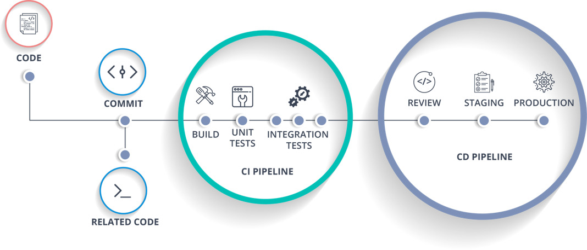

=== Course ===
- [Scheduling Selenium TestNG tests via Jenkins CI/CD tool](https://www.coursera.org/projects/scheduling-selenium-testng-tests-via-ci-cd-tools-jenkins) from Coursera Project Network (instructor: Saurabh Dhingra)

=== Tasks ===
- Task 1: Understanding CI/CD and Setting up a Jenkins job
- Task 2:  Fetching code from GIT repository via Jenkins
- Task 3:  Running Selenium tests via command line
- Task 4: Running Selenium tests via Jenkins
- Task 5: Scheduling Selenium tests via Jenkins



=== Notes ===
- Jenkins
	- Install Jenkins.  Needs a local administrator account to run on
	- Dashboard: http://localhost:8080/
	- Create a job:
		- New Item > Freestyle project
		- Source Code Management (to download from GitHub):
			- Repository URL: `https://github.com/yingalice/selenium-tutorials-java.git`
			- Branch Specifier: `*/main`
		- Build Triggers (scheduled build):
			- Build peridically (option presented in this course, but is not recommended by Jenkins for CI/CD)
				- Use cron syntax `MINUTE HOUR DOM MONTH DOW`
		- Build Steps:
			- Add Build Step > Invoke top-level Maven targets
				- Goals: `clean test`
			- Advanced > Pom: `coursera-RunTestNGJenkins/pom.xml`
		- Build now (manual build)
		- Workspace:
			- Can see downloaded code

- Maven
	- Install Maven to run in command line outside of Eclipse, and add its /bin to PATH
	- Run manually on command line:
		- `mvn clean`
			- Deletes target/ folder
		- `mvn test`
			- Executes any *Test.java under src/test/java
			- Executes tests listed in pom.xml.  Looks for the testng xml file listed under the surefire plugin
				```
				<plugin>
					<groupId>org.apache.maven.plugins</groupId>
					<artifactId>maven-surefire-plugin</artifactId>
					<version>3.2.5</version>
					<configuration>
						<suiteXmlFiles> <!-- TestNG suite XML files -->
							<suiteXmlFile>testXmlFiles/amazonHomepage.xml</suiteXmlFile>
						</suiteXmlFiles>
					</configuration>
				</plugin>
				```
