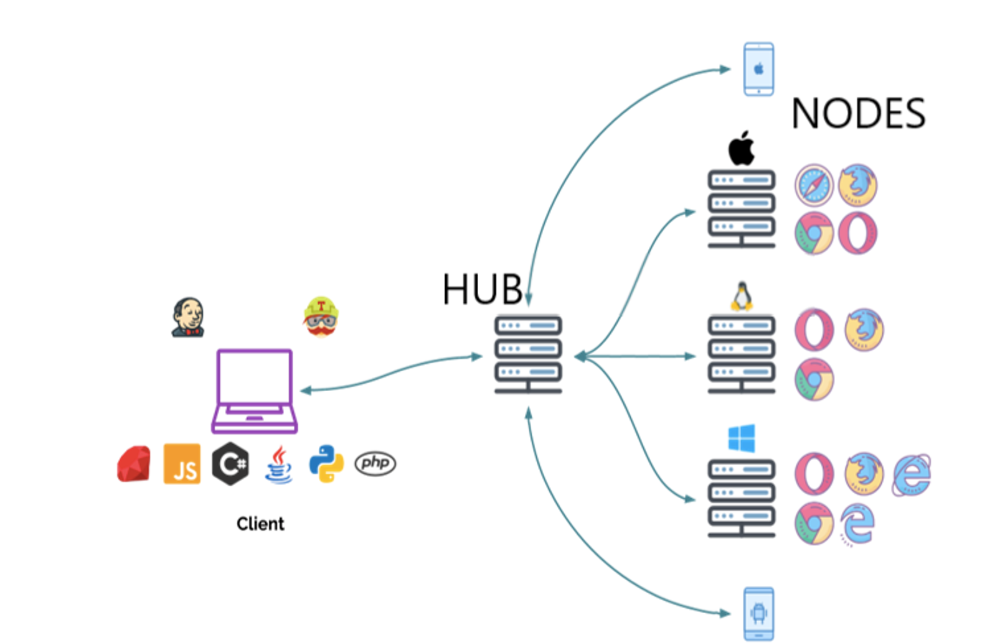

=== Course ===
- [Selenium Grid - Running Selenium tests in parallel](https://www.coursera.org/projects/selenium-grid-running-selenium-tests-in-parallel) from Coursera Project Network (instructor: Saurabh Dhingra)

=== Tasks ===
- Task 1: Selenium Grid Setup – Running Node and Hub
- Task 2: Running Selenium tests via Selenium Grid on chrome browsers
- Task 3: Running Selenium tests via Selenium Grid on multiple browsers
- Task 4: Selenium Grid configuration using the JSON file
- Task 5: Running Selenium Tests parallelly on multiple browsers via Selenium Grid driven



=== Notes ===
- Hub
  - Central point where we load our tests
  - Initiate tests here, and hub will distribute it to the nodes for execution
  - Only 1 hub in a Grid
  - Launched on a single machine
- Node
  - Executes the tests that you loaded on the hub
  - Can be more than 1 Node in a Grid
  - Can be launched on multiple machines with different browsers and platforms
- Running Selenium Grid
  - CLI (run each command on a different command prompt)
    - Hub and Node on same machine:
      - `java -jar selenium-server-4.16.1.jar hub`
        - http://192.168.0.208:4444/ui
      - `java -jar selenium-server-4.16.1.jar node --selenium-manager true`
    - Hub and Node on different machine:
      - `java -jar selenium-server-4.16.1.jar hub`
      - `java -jar selenium-server-4.16.1.jar node --selenium-manager true --hub http://<hub-ip>:4444`
  - TOML file
    - Used to specify configs, instead of placing them all on the command line
    - `java -jar selenium-server-4.16.1.jar hub`
    - `java -jar selenium-server-4.16.1.jar node --config node_a.toml`
    - `java -jar selenium-server-4.16.1.jar node --config node_b.toml`
    - node_a.toml:
      ```
      [server]
      port = 5555

      [node]
      max-sessions = 10
      selenium-manager = true
      ```
  - Use RemoteWebDriver, and specify browser as Options
    ```
    URL remoteUrl = new URI("http://192.168.0.208:4444/").toURL();  // Hub IP
    if (browserType.equals("chrome")) {
      ChromeOptions options = new ChromeOptions();
      driver = new RemoteWebDriver(remoteUrl, options);
    }
    ```
  - Run the same test on multiple browsers by using parameters
    - myTest.java
      - @Parameter is read from testng.xml, and substituted into the method's parameters
        ```
        @Parameters ("browserType")
        @Test
        public void invokeBrowser(String browserType) {
        ```
    - testng.xml
      - Duplicate `<test>` for each browser
      - Specify `<parameter>` for each browser
      - Add `parallel="tests"` on `<suite>` to run tests parallelly
        ```
        <suite name="Suite" parallel="tests">
          <test thread-count="5" name="Chrome Test">
            <parameter name="browserType" value="chrome"/>
            <classes>
              <class name="tests.MultipleBrowserTest"/>
            </classes>
          </test>
        </suite>
        ```